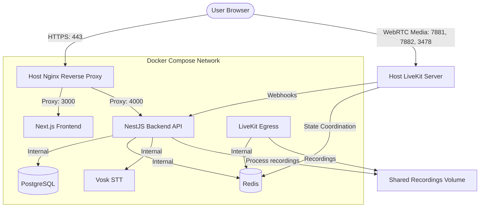

# Quran LMS — Production Deployment Guide for Ubuntu LTS

This guide provides step-by-step instructions for deploying the first version of the Quran LMS application on an Ubuntu LTS server (Xeon Workstation, 64GB RAM).

---

## 1. Architecture Overview

In production, the platform is split between Dockerized services and host-level services:



- **Docker Compose (`docker-compose.prod.yml`)** manages PostgreSQL, Redis, Vosk, NestJS, Next.js, and LiveKit Egress.
- **Host System Services** manages Nginx (as reverse proxy with SSL) and LiveKit Media Server (running directly on the host to avoid container networking overhead for WebRTC).

---

## 2. Prerequisites & DNS Setup

### Server Requirements
- Operating System: Ubuntu 22.04 LTS or 24.04 LTS
- Specs: Xeon Workstation with 64GB RAM (more than sufficient)
- Docker & Docker Compose installed: [Docker Install Guide](https://docs.docker.com/engine/install/ubuntu/)
- Node.js v20+ (for building/testing tasks): [NodeSource Node.js install](https://github.com/nodesource/distributions)

### DNS Configurations (Cloudflare)
You must configure two A records in your Cloudflare dashboard pointing to your server's public IP:

1. **`quran-lms.kpcybers.com`**
   - Type: `A`
   - IP: `YOUR_SERVER_PUBLIC_IP`
   - Proxy status: **Proxied (Orange Cloud)**
2. **`livekit.kpcybers.com`**
   - Type: `A`
   - IP: `YOUR_SERVER_PUBLIC_IP`
   - Proxy status: **DNS-only (Grey Cloud)** — **CRITICAL**: WebRTC media traffic cannot be proxied through Cloudflare.

### Cloudflare Dashboard Configuration
- **SSL/TLS Mode**: Set encryption mode to **Full (Strict)**.
- **WebSockets**: Navigate to **Network** → Ensure **WebSockets** is toggled **ON** (required for client connectivity).
- **Upload Limit**: Under **Rules** or **Caching**, ensure client request size limits allow uploading recordings if needed.

### Ubuntu Firewall (UFW) Configuration
Run the following commands on your Ubuntu server to configure the firewall:

```bash
# Allow SSH
sudo ufw allow OpenSSH

# Allow HTTP and HTTPS for Nginx
sudo ufw allow http
sudo ufw allow https

# Allow LiveKit RTC Ports (WebRTC Media)
sudo ufw allow 7880/tcp   # LiveKit HTTP/WS Signaling
sudo ufw allow 7881/tcp   # LiveKit ICE-TCP
sudo ufw allow 7882/udp   # LiveKit Media UDP
sudo ufw allow 3478/udp   # LiveKit TURN UDP

# Enable Firewall
sudo ufw enable
sudo ufw status
```

---

## 3. Deployment Steps

### Step 1: Clone the Repository
On your server, clone the repository to your deployment directory (e.g., `/var/www/quran-lms`):

```bash
sudo mkdir -p /var/www
sudo chown -R $USER:$USER /var/www
cd /var/www
git clone <your-repository-url> quran-lms
cd quran-lms
```

### Step 2: Configure Environment Variables
Copy the production environment template and edit the secrets:

```bash
cp .env.example .env
nano .env
```

Ensure the following variables are customized:
- `POSTGRES_PASSWORD`: Use a strong random database password.
- `JWT_SECRET` & `JWT_REFRESH_SECRET`: Generate long secure strings (`openssl rand -hex 32`).
- `GEMINI_API_KEY`: Add your Gemini flash API key.
- `LIVEKIT_API_KEY` & `LIVEKIT_API_SECRET`: Generate custom values (`openssl rand -hex 16`).

---

### Step 3: Install & Configure LiveKit Server (Host)
Download and install the LiveKit binary on the Ubuntu host:

```bash
# Download and install LiveKit Server
curl -sSL https://get.livekit.io | bash

# Copy the production LiveKit configuration template
cp livekit-prod.yaml /etc/livekit.yaml
```

Now, edit `/etc/livekit.yaml` and set the keys to match the `LIVEKIT_API_KEY` and `LIVEKIT_API_SECRET` you generated in your `.env` file:

```bash
sudo nano /etc/livekit.yaml
```

Create a systemd service file to keep LiveKit running in the background and restart on boot:

```bash
sudo nano /etc/systemd/system/livekit.service
```

Paste the following service definition:

```ini
[Unit]
Description=LiveKit Server
After=network.target

[Service]
Type=simple
User=root
LimitNOFILE=65535
ExecStart=/usr/local/bin/livekit-server --config /etc/livekit.yaml
Restart=on-failure
RestartSec=5

[Install]
WantedBy=multi-user.target
```

Enable and start the LiveKit service:

```bash
sudo systemctl daemon-reload
sudo systemctl enable livekit
sudo systemctl start livekit
sudo systemctl status livekit
```

---

### Step 4: Setup SSL Certificates via Certbot
Since we are using Cloudflare Full (Strict) SSL, Nginx needs a valid certificate. We will generate a Let's Encrypt certificate:

```bash
sudo apt update
sudo apt install -y certbot python3-certbot-nginx

# Request certificate (Certbot will automatically configure the challenge)
sudo certbot certonly --nginx -d quran-lms.kpcybers.com
```

This will save certificates at:
- Cert: `/etc/letsencrypt/live/quran-lms.kpcybers.com/fullchain.pem`
- Key: `/etc/letsencrypt/live/quran-lms.kpcybers.com/privkey.pem`

---

### Step 5: Configure Host Nginx
Copy Nginx production config to the system directories:

```bash
sudo cp nginx.conf /etc/nginx/sites-available/quran-lms
sudo ln -s /etc/nginx/sites-available/quran-lms /etc/nginx/sites-enabled/

# Remove default site if it exists to avoid conflicts
sudo rm -f /etc/nginx/sites-enabled/default

# Test Nginx syntax and reload
sudo nginx -t
sudo systemctl reload nginx
```

---

### Step 6: Start Dockerized Services
Run Docker Compose to build images and spin up containers:

```bash
# Build and start services in detached mode
docker compose -f docker-compose.yml -f docker-compose.prod.yml up -d --build
```

Verify that all containers are healthy:

```bash
docker compose -f docker-compose.yml -f docker-compose.prod.yml ps
```

---

### Step 7: Initialize Database & Run Migrations
Run Prisma migrations inside the NestJS container to configure the database schema:

```bash
docker exec -it quran-lms-nestjs npx prisma migrate deploy
```

*(Optional)* Run the seed script to create initial roles and credentials (Admin: `admin@quran-lms.com`, Password: `password123`):

```bash
docker exec -it quran-lms-nestjs npm run seed
```

---

## 4. Updates & Zero-Downtime Redeployment

When you push new changes, run this workflow on your server to update the application:

```bash
# Pull latest code
git pull origin main

# Rebuild and restart app containers
docker compose -f docker-compose.yml -f docker-compose.prod.yml up -d --build --remove-orphans

# Apply new database migrations if any
docker exec -it quran-lms-nestjs npx prisma migrate deploy
```

---

## 5. Backup & Maintenance

### PostgreSQL Database Backups
Create a daily cron job to backup the database. Create the script:

```bash
nano /home/ubuntu/backup_db.sh
```

Paste the following script:

```bash
#!/bin/bash
BACKUP_DIR="/var/backups/quran-lms"
mkdir -p $BACKUP_DIR
DATE=$(date +%F_%H-%M-%S)
docker exec quran-lms-postgres pg_dump -U postgres quran_lms > $BACKUP_DIR/db_backup_$DATE.sql
# Keep only last 14 days of backups
find $BACKUP_DIR -type f -mtime +14 -delete
```

Make it executable and configure it in cron:

```bash
chmod +x /home/ubuntu/backup_db.sh
crontab -e
# Add line: 0 2 * * * /home/ubuntu/backup_db.sh (Runs daily at 2:00 AM)
```

### Video Recordings Storage
Video recordings are persisted inside the Docker volume `quran-lms_recordings_data` mapped to `/app/recordings`. You can back this directory up using standard `rsync` or copy commands.

---

## 6. Troubleshooting

- **Check container logs**: `docker compose -f docker-compose.yml -f docker-compose.prod.yml logs -f <service_name>` (e.g., `nestjs`, `nextjs`, `egress`).
- **Check LiveKit logs**: `sudo journalctl -u livekit -f -n 100`
- **Database Connection Error**: Verify `DATABASE_URL` in `.env` uses `postgres` as the hostname and matches the generated credentials.
- **WebSocket / WebRTC Handshake fails**: Verify port `7880` and `7882/udp` are fully open in UFW, and that `livekit.kpcybers.com` is configured as **DNS-only** (no Cloudflare proxy icon).
