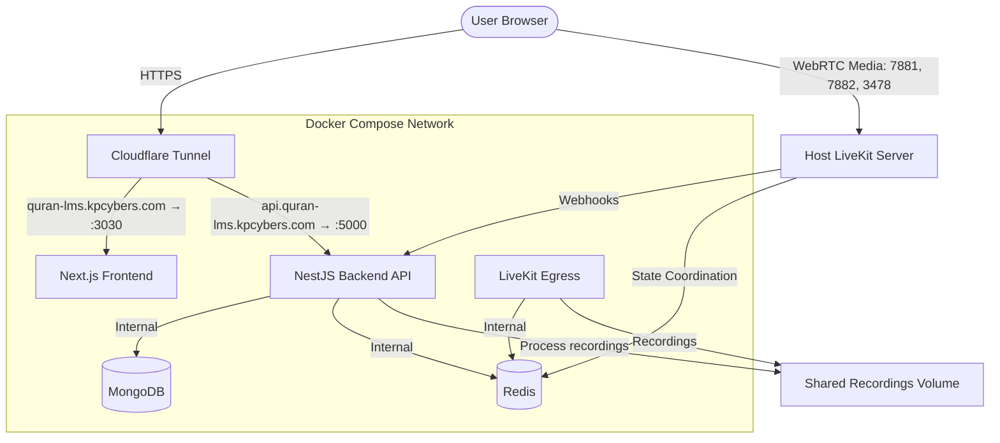

# Quran LMS — Production Deployment Guide for Ubuntu LTS

This guide provides step-by-step instructions for deploying the Quran LMS application on an Ubuntu LTS server. All services run in **Docker** and are exposed publicly via **Cloudflare Tunnels** using **subdomain-based routing**.

---

## 1. Architecture Overview

The platform is split between Dockerized services and a host-level LiveKit server. Public traffic is routed through a Cloudflare Tunnel using dedicated subdomains for each service:


```mermaid
graph TD
    User([User Browser]) -->|HTTPS| CF[Cloudflare Tunnel]
    User -->|WebRTC Media: 7881, 7882, 3478| LiveKit[Host LiveKit Server]
    
    subgraph Docker Compose Network
        CF -->|quran-lms.kpcybers.com → :3030| NextJS[Next.js Frontend]
        CF -->|api.quran-lms.kpcybers.com → :5000| NestJS[NestJS Backend API]
        NestJS -->|Internal| Mongo[(MongoDB)]
        NestJS -->|Internal| Redis[(Redis)]
        Egress[LiveKit Egress] -->|Internal| Redis
    end
    
    LiveKit -->|Webhooks| NestJS
    LiveKit -->|State Coordination| Redis
    Egress -->|Recordings| Volume[Shared Recordings Volume]
    NestJS -->|Process recordings| Volume
```

### Host Port Mapping

| Service | Internal (Container) Port | Host Mapping (Configured in `.env`) |
|---|---|---|
| **Next.js Frontend** | `3030` | **`127.0.0.1:3030:3030`** |
| **NestJS Backend API** | `5000` | **`127.0.0.1:5000:5000`** |
| **Redis Queue Broker** | `6379` | **`127.0.0.1:6380:6379`** |

---

## 2. Deployment Steps

### Step 1: Configure Environment Variables

```env
MONGODB_URI=mongodb://127.0.0.1:27017/quran_lms
REDIS_HOST=redis
REDIS_PORT=6379
PORT=5000
```

### Step 2: Start Dockerized Services

```bash
docker compose -f docker-compose.yml -f docker-compose.prod.yml up -d --build
```

### Step 3: Seed Database

```bash
docker exec -it quran-lms-nestjs npm run seed
```
